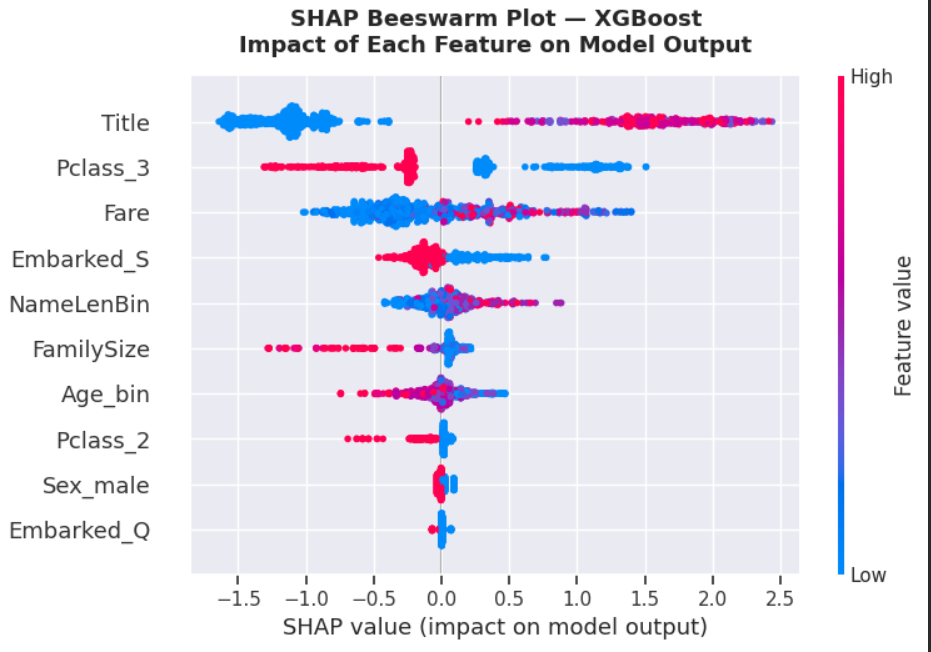
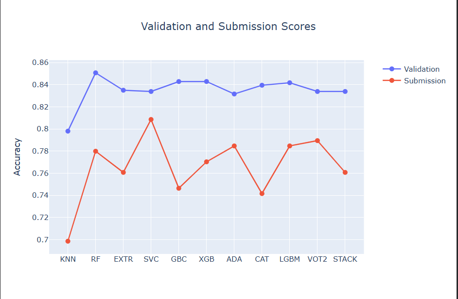
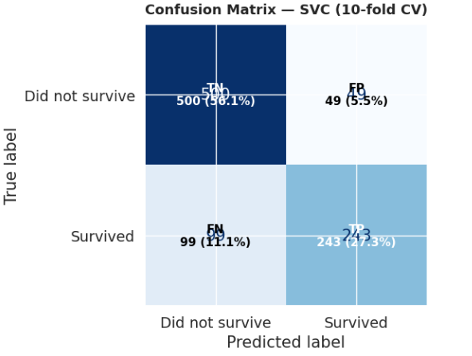

#  Titanic — Survival Prediction


> **Kaggle Competition:** [Titanic — Machine Learning from Disaster](https://www.kaggle.com/competitions/titanic)  
> **Best submission score:** `0.80861` (Top ~20%) — Support Vector Classifier  
> **Kaggle profile:** _[add your username here]_

---

##  Problem Overview

The sinking of the Titanic in 1912 left 1,502 of 2,224 passengers dead. Survival was far from random — passenger class, sex, age, and family size all played measurable roles. The goal of this competition is to build a model that predicts which passengers survived, using these features as inputs.

This project goes beyond a basic submission: it includes rigorous statistical analysis, extensive feature engineering, systematic comparison of 11 classifiers, and full model interpretability via SHAP values.

---

##  Results

| Model | CV Accuracy (10-fold) | Kaggle Score |
|---|---|---|
| **SVC** | — | **0.80861**  |
| Voting Classifier | — | 0.78947 |
| AdaBoost | — | 0.78468 |
| LightGBM | — | 0.78468 |
| Random Forest | — | 0.77990 |
| XGBoost | — | 0.77033 |
| Decision Tree | — | 0.76076 |
| Extra Trees | — | 0.76076 |
| Stacking Classifier | — | 0.76076 |
| GBC | — | 0.74641 |
| KNN | — | 0.69856 |

---

##  Project Structure

```
Titanic Practice/
│
├── Titanic_Practice.ipynb          # Main notebook — full analysis
├── README.md
│
├── data/
│   ├── train.csv
│   └── test.csv
│
├── images/                # Key visualizations for README
│   ├── shap_beeswarm.png
│   ├── model_comparison.png
│   └── confusion_matrix.png
│
└── submissions/
    └── svc_best.csv       # Best submission (0.80861)
```

---

##  Methodology

### 1. Exploratory Data Analysis
- Descriptive statistics and **Pearson correlation** with the target variable
- **Chi-squared tests** + Cramér's V for all categorical features — quantifying statistical significance
- Survival rate tables broken down by sex, class, port of embarkation, and age group
- Visual analysis: FacetGrids, violin plots, swarm plots, and heatmaps

### 2. Feature Engineering
| Feature | Description | Rationale |
|---|---|---|
| `Title` | Extracted from passenger name | Encodes sex + social status simultaneously |
| `FamilySize` | `SibSp + Parch + 1` | Medium families had better survival odds |
| `Alone` | Binary flag for solo travelers | Solo travelers had lower survival |
| `NameLenBin` | Name length binned in intervals of 5 | Longer names correlate with higher class |
| `Age_bin` | Age discretized into 10-year bins | Reduces outlier influence |
| `Fare_bin` | Fare discretized into 50-unit bins | Reduces outlier influence |

**Missing value strategy:**
- `Age` → imputed by **title group mean** (not global mean) to preserve sub-population distributions
- `Embarked` → mode imputation (2 missing values)
- `Cabin` → dropped (~77% missing)

### 3. Modeling
Trained and tuned **11 classifiers** covering 5 ML families:
- Instance-based: KNN
- Tree-based: Decision Tree, Random Forest, Extra Trees
- Kernel-based: SVC
- Gradient Boosting: GBC, XGBoost, AdaBoost, CatBoost, LightGBM
- Meta-learners: Voting Classifier (soft), Stacking Classifier

All models tuned with **GridSearchCV / RandomizedSearchCV** and evaluated via **10-fold stratified cross-validation**.

### 4. Evaluation
Beyond accuracy: **learning curves** for bias-variance diagnosis, **confusion matrix**, **ROC-AUC**, precision, recall, and F1 for all models.

### 5. Interpretability — SHAP
- **Beeswarm plot:** global feature impact with direction and magnitude per passenger
- **Dependence plots:** non-linear effects and feature interactions
- **Waterfall plots:** individual prediction explanations for specific passengers

---

## 🖼️Key Visualizations

### SHAP Beeswarm — What drives survival predictions?
<!-- Replace with your actual screenshot -->


### Model Comparison — CV vs. Kaggle Score
<!-- Replace with your actual screenshot -->


### Confusion Matrix + ROC Curve — Best Model (SVC)
<!-- Replace with your actual screenshot -->


---

## 🛠️ Tech Stack

| Category | Libraries |
|---|---|
| Data manipulation | `pandas`, `numpy` |
| Visualization | `matplotlib`, `seaborn`, `plotly` |
| Machine Learning | `scikit-learn`, `xgboost`, `lightgbm`, `catboost`, `mlxtend` |
| Interpretability | `shap` |
| Statistics | `scipy` |

---

##  How to Run

```bash
# 1. Clone the repository
git clone https://github.com/YOUR_USERNAME/titanic-survival-prediction.git
cd titanic-survival-prediction

# 2. Install dependencies
pip install -r requirements.txt

# 3. Open the notebook
jupyter notebook Titanic.ipynb
```

Or run directly in Google Colab:

[](https://colab.research.google.com/github/YOUR_USERNAME/titanic-survival-prediction/blob/main/Titanic.ipynb)

---

##  Requirements

```
pandas
numpy
matplotlib
seaborn
plotly
scikit-learn
xgboost
lightgbm
catboost
mlxtend
shap
scipy
jupyter
```

---

## 👤 Author

**Jeyson** — Engineering student passionate about embedded systems, robotics, and data science.

- GitHub: [@YOUR_USERNAME](https://github.com/YOUR_USERNAME)
- Kaggle: [@YOUR_KAGGLE](https://www.kaggle.com/YOUR_KAGGLE)

---

<p align="center">
  <i>This project is part of my data science portfolio. Feel free to open an issue or reach out if you have questions.</i>
</p>
